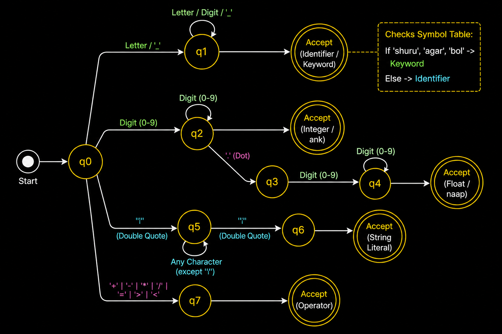
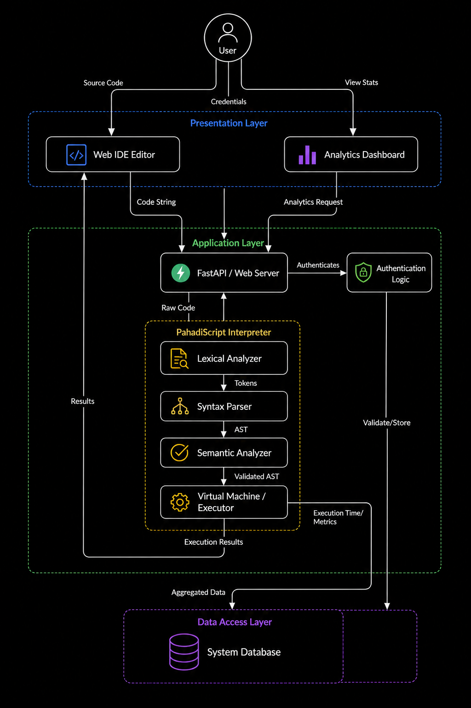
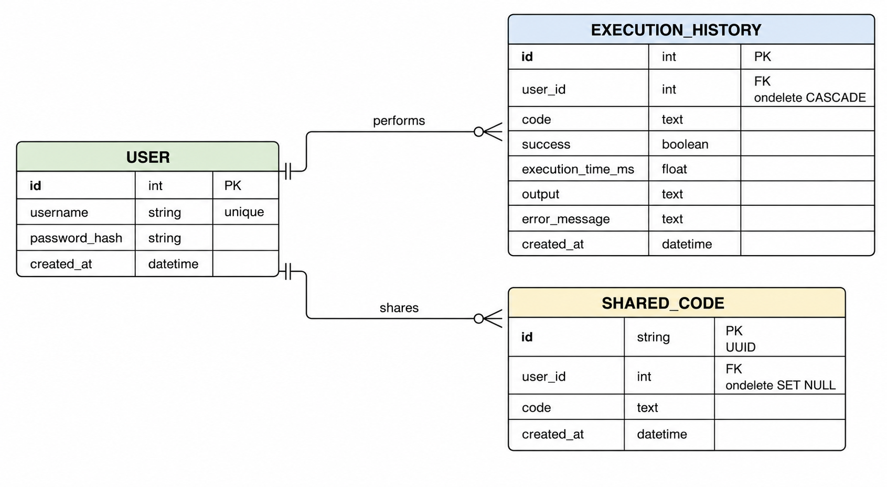
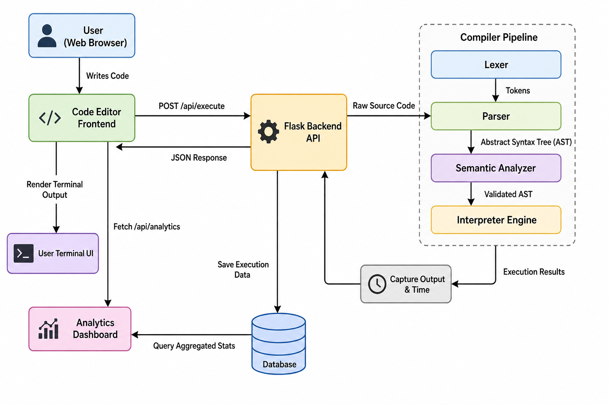

# 🏔️ HimalayanCode: PahadiScript Web Interpreter

[](https://python.org)
[](https://nextjs.org/)
[](https://react.dev/)
[](https://www.typescriptlang.org/)
[](https://tailwindcss.com/)
[](https://supabase.com)
[](https://www.dabeaz.com/ply/)

A full-stack, web-based IDE and interpreter for **PahadiScript** — a Himalayan-inspired educational programming language featuring Hindi-based keywords, custom compiler engine, interactive editor, execution metrics dashboard, and permalink code sharing.

> **Code in the language of the mountains** - *Think in Hindi, Build in Code.*

---

## 📸 System Overview & State DFA



---

## 1. Problem Statement

Many students enter engineering without having Computer Science as a subject in their school education. In Class 12, a large number of students choose other optional subjects instead of Computer Science. As a result, when they start their first year of engineering, they face difficulty in understanding basic programming concepts, especially in languages like C.

These students often struggle with syntax, logic building, and implementation because everything is new to them. The use of English keywords in programming languages adds another level of difficulty, making it harder for them to learn quickly and confidently. This gap affects their ability to build a strong foundation in programming during the early stages of their engineering journey.

To solve this problem, **PahadiScript** is introduced as a beginner-friendly programming language that uses simple Hindi-based keywords. It allows students to write code in a more familiar language, helping them understand concepts more easily. The main goal is to support students who are new to programming so they can build their basics in the first and second year of engineering and improve their overall learning experience.

---

## 2. Need of the Project

1. **Syntax Barrier Removal**: English-based syntax creates an extra barrier for students who are more comfortable in Hindi.
2. **Logic-First Focus**: Beginners can focus on logic building rather than getting stuck in complex syntax error loops.
3. **Compiler Design Practical Application**: Demonstrates complete compiler design lifecycle (Lexer, Parser CFG, AST, Tree-walk Interpreter, Frame Stacks).
4. **Interactive Web IDE**: Provides live feedback, output console, execution metrics, and performance analytics.

---

## 3. Objectives

### 3.1 Main Objective
Design and develop a simple, beginner-friendly programming language called **PahadiScript** using Hindi-based keywords to make learning programming intuitive, backed by a production-grade Web IDE and compiler environment.

### 3.2 Specific Objectives
- **Lexical Analysis**: Implement Lexer using PLY (`ply.lex`) for tokenizing Hindi PahadiScript keywords.
- **Context-Free Grammar Parser**: Construct Yacc Parser (`ply.yacc`) for checking syntax, building AST nodes, and handling loops/conditionals/structs.
- **Runtime Interpreter**: Build a frame-stack based evaluation engine with 2.0s execution timeout and `100,000` iteration loop bounds.
- **Modern Web IDE**: Develop a Next.js 15 (React 19 + TypeScript + Tailwind CSS v4) frontend with CodeMirror integration and ambient glassmorphism UI.
- **Analytics & History**: Provide execution metrics dashboards (Chart.js), history logs, and code permalink sharing.

---

## 4. Architectural Design Diagrams

### Level 0 DFD


### Level 1 DFD


### System Architecture


### Entity-Relationship Diagram (ER)


---

## 5. Tools and Technologies Used

| Component | Technology Used |
| :--- | :--- |
| **Frontend IDE** | Next.js 15 (App Router), React 19, TypeScript, CodeMirror (`@uiw/react-codemirror`), Chart.js |
| **Styling & Aesthetics** | Tailwind CSS v4, Glassmorphism Backdrop Blur, Ambient Video Layer |
| **Compiler Engine** | Python 3.11+, PLY (Python Lex-Yacc Lexer & Parser), AST Dataclasses |
| **Database & Auth** | Supabase (PostgreSQL), JWT Cookie Sessions, Google OAuth Schema |
| **API Layer** | Next.js Serverless API Routes spawning Python Subprocess IPC |

---

## 🗣️ Language Specification (20 Reserved Keywords)

PahadiScript maps standard programming operations to intuitive Hindi keywords:

| Keyword | C / Standard Equivalent | Purpose |
| :--- | :--- | :--- |
| `shuru` | `main` | Entry point block of the script |
| `le` | `var / auto` | Variable declaration |
| `ank` | `int` | Integer data type |
| `naap` | `float` | Floating point data type |
| `akshar` | `char / string` | Character / String data type |
| `bol` | `printf` | Standard output statement |
| `sun` | `scanf` | Standard input prompt statement |
| `agar` | `if` | Conditional branch |
| `magar` | `else` | Alternative branch |
| `phir` | `for` | Iterative loop |
| `jabtak` | `while` | Conditional loop |
| `bas` | `break` | Terminate loop execution |
| `chalo` | `continue` | Skip to next loop iteration |
| `kaam` | `function` | Function definition |
| `paucha` | `return` | Return value from function |
| `sahi` | `true` | Boolean True |
| `galat` | `false` | Boolean False |
| `khali` | `void` | Null / No return type |
| `roko` | `exit` | Terminate program execution |
| `dhancha` | `struct` | Custom data structure |

---

## 🔄 Program Work Flow



---

## 🚀 Getting Started (Setup & Installation)

Follow these steps to set up and run the PahadiScript Web IDE locally.

### Prerequisites
- **Python 3.11+** installed.
- **Node.js v18+** and `npm` installed.

---

### 1. Backend & Compiler Setup

1. **Install Python Dependencies**:
   ```bash
   pip install -r requirements.txt
   ```

2. **Test Compiler CLI**:
   ```bash
   echo '{"code":"shuru { le ank x = 10; bol x; }"}' | python run_compiler.py
   ```

---

### 2. Frontend Setup & Run

1. **Navigate to the `landing` directory**:
   ```bash
   cd landing
   ```

2. **Install Node Dependencies**:
   ```bash
   npm install
   ```

3. **Start Development Server**:
   ```bash
   npm run dev
   ```

4. **Access the Application**:
   Open browser at `http://localhost:3000`.

---

## 🧪 PahadiScript Example Program

```pahadiscript
kaam ank guna(ank x, ank y) {
    paucha x * y;
}

dhancha Bindu {
    ank x;
    ank y;
}

shuru {
    le Bindu p;
    p.x = 6;
    p.y = 7;
    
    le ank result = guna(p.x, p.y);
    bol "Namaste Pahad! Result is:";
    bol result;
}
```

---

## 📜 License

Distributed under the MIT License. See `LICENSE` for more information.
